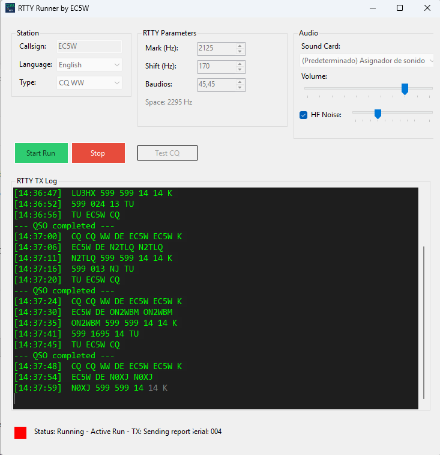

# RTTY Runner by EC5W



## English

A Windows application that simulates RTTY (RadioTeletype) contest runs for calibrating and testing RTTY decoders like MMTTY, Fldigi, or WSJT-X.

### Features

- **RTTY Generation**: Standard 45.45 baud FSK modulation with ITA2 Baudot encoding
- **Contest Simulation**: Realistic QSO sequences for CQ WPX RTTY and CQ WW RTTY contests
- **Realistic Callsigns**: 70% USA/Canada stations with proper state codes for CQ WW RTTY
- **HF Noise Simulation**: Authentic 40m band noise with QRM, splatters, and atmospheric effects
- **Configurable Parameters**:
  - Mark frequency (default 2125 Hz)
  - Shift (default 170 Hz)
  - Baud rate (default 45.45)
  - Volume and noise level
- **Transmit Side Selection**: Transmit both sides of the QSO, only the calling station (CQ, report, TU) or only the responding stations (call and QSL). Muted messages are replaced by a pause of the same length so the QSO rhythm is preserved
- **Sound Card Selection**: Choose your audio output device
- **Bilingual Interface**: Spanish and English

### Technical Specifications

| Parameter | Value |
|-----------|-------|
| Baud Rate | 45.45 baud |
| Bit Duration | 22.0 ms |
| Start Bit | 1 (Space) |
| Data Bits | 5 (Baudot ITA2) |
| Stop Bits | 1.5 (Mark) |
| Shift | 170 Hz |
| Mark Frequency | 2125 Hz |
| Space Frequency | 2295 Hz |

### Usage

1. Download the appropriate executable for your system (x64 or x86)
2. Run `RTTYContestSimulator.exe`
3. Select your sound card
4. Configure your callsign
5. Choose contest type (CQ WPX or CQ WW)
6. Choose which side to transmit: both, caller only or responders only
7. Click "Start Run" to begin the simulation
8. Connect the audio output to your RTTY decoder software

### Downloads

- `RTTYContestSimulator_x64.exe` - For 64-bit Windows
- `RTTYContestSimulator_x86.exe` - For 32-bit Windows

### Building from Source

Requirements:
- .NET 9.0 SDK
- Windows

```bash
dotnet build -c Release
dotnet publish -c Release -r win-x64 --self-contained true -p:PublishSingleFile=true
```

---

## Castellano

Una aplicacion Windows que simula runs de concurso RTTY (RadioTeletipo) para calibrar y probar decodificadores RTTY como MMTTY, Fldigi o WSJT-X.

### Caracteristicas

- **Generacion RTTY**: Modulacion FSK estandar a 45.45 baudios con codificacion Baudot ITA2
- **Simulacion de Concurso**: Secuencias de QSO realistas para concursos CQ WPX RTTY y CQ WW RTTY
- **Indicativos Realistas**: 70% estaciones USA/Canada con codigos de estado correctos para CQ WW RTTY
- **Simulacion de Ruido HF**: Ruido autentico de banda de 40m con QRM, splatters y efectos atmosfericos
- **Parametros Configurables**:
  - Frecuencia Mark (por defecto 2125 Hz)
  - Shift (por defecto 170 Hz)
  - Velocidad en baudios (por defecto 45.45)
  - Volumen y nivel de ruido
- **Seleccion de Lado a Transmitir**: Transmite ambos lados del QSO, solo la estacion que llama (CQ, reporte, TU) o solo las estaciones que contestan (llamada y QSL). Los mensajes silenciados se sustituyen por una pausa de la misma duracion para mantener el ritmo del QSO
- **Seleccion de Tarjeta de Sonido**: Elige tu dispositivo de salida de audio
- **Interfaz Bilingue**: Espanol e Ingles

### Especificaciones Tecnicas

| Parametro | Valor |
|-----------|-------|
| Velocidad | 45.45 baudios |
| Duracion de bit | 22.0 ms |
| Bit de inicio | 1 (Space) |
| Bits de datos | 5 (Baudot ITA2) |
| Bits de parada | 1.5 (Mark) |
| Shift | 170 Hz |
| Frecuencia Mark | 2125 Hz |
| Frecuencia Space | 2295 Hz |

### Uso

1. Descarga el ejecutable apropiado para tu sistema (x64 o x86)
2. Ejecuta `RTTYContestSimulator.exe`
3. Selecciona tu tarjeta de sonido
4. Configura tu indicativo
5. Elige el tipo de concurso (CQ WPX o CQ WW)
6. Elige que lado transmitir: ambos, solo quien llama o solo quien contesta
7. Haz clic en "Iniciar Run" para comenzar la simulacion
8. Conecta la salida de audio a tu software decodificador RTTY

### Descargas

- `RTTYContestSimulator_x64.exe` - Para Windows 64-bit
- `RTTYContestSimulator_x86.exe` - Para Windows 32-bit

### Compilar desde Codigo Fuente

Requisitos:
- .NET 9.0 SDK
- Windows

```bash
dotnet build -c Release
dotnet publish -c Release -r win-x64 --self-contained true -p:PublishSingleFile=true
```

---

## License

MIT License - Free to use and modify.

## Author

EC5W
